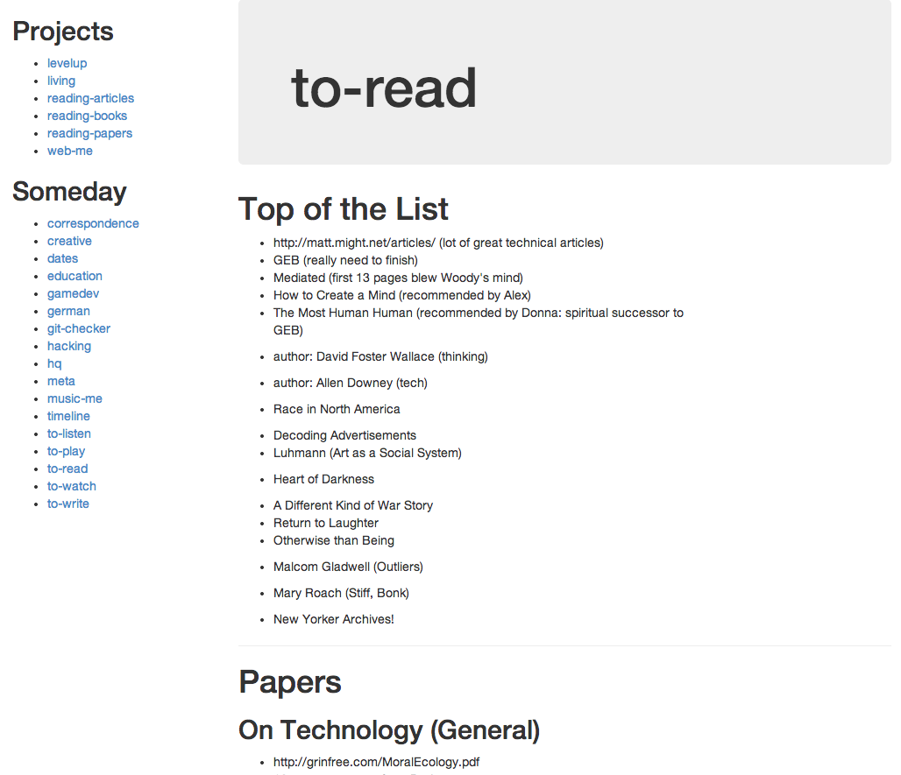

# org

## Summary
Write up your projects and resources in Markdown, host and view locally on a Mac (with Apache/PHP).

## Setup
- As of OSX 10.8, they've removed the 'web sharing' ability, so I downloaded [this](http://clickontyler.com/blog/2012/02/web-sharing-mountain-lion/) to bring it back. (OSX keeps apache and php in, so you just need to enable the web sharing).

- [Modify](http://danilo.ariadoss.com/how-to-setup-apache-php-mysql-on-mac-os-x-105-leopard/) some config file settings to get it to work (/etc/apache2/httpd.conf and /etc/php.ini).

- Don't make the PHP error reporting any stricter, because it's annoying as hell and unnecessary.

- [Change](http://www.phpied.com/installing-php-and-apache-on-mac-osx-that-was-pretty-easy/) the document root in TWO PLACES to something like /Users/<uname> (/etc/apache2/httpd.conf).

- [Allow](http://forums.cpanel.net/f5/allow-php-htm-html-pages-89345.html) PHP in HTML pages (/etc/apache2/httpd.conf).

That should be it. You might have to do a bit of fiddling with the paths in Sites/ or org/ if they've changed, but you should be good to go. Until next catastrophe.

## Configure
You'll want to edit the following variables in `org.html` (this should be configured in another way, but there's no reason to bother unless someone else ever uses this).
- `$orgDir` : This should point to your main directory that contains `projects` and `someday` directories.
- `$idxFilename` : This is what it will look for as the 'index' for each project.

## How you should place files
It assumes under your `$ordDir` you have two directories, `projects` and `someday`. It then assumes that you have one folder per project (project folders go in either of these directories). Then, it expects you have a file of the name `$idxFilename`, which it will parse/render as Markdown. At the bottom of each index file, it will generate a 'resources` section with links to all other files that you put in that project directory.

## Thanks to
- [PHP Markdown](https://github.com/michelf/php-markdown) (I modified to do word wrapping and improve bulleted spacing)
- [Bootstrap](https://github.com/twbs/bootstrap)
- This system is a variant of an idea from [GTD by David Allen](http://en.wikipedia.org/wiki/Getting_Things_Done).